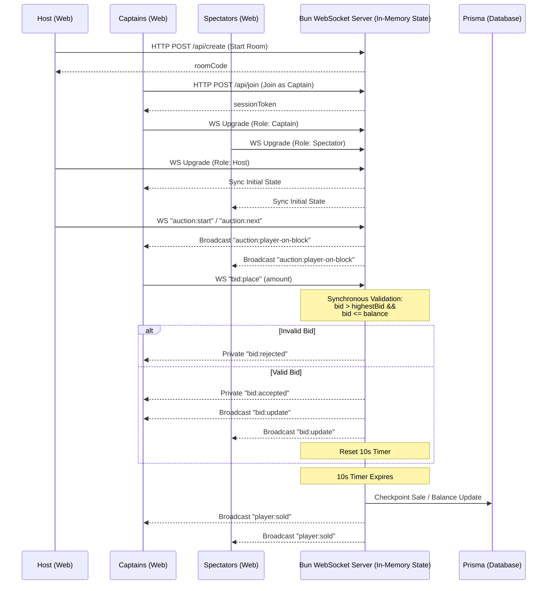

# Football Auction Platform

A real-time, server-authoritative auction platform designed for a friend group's football team-picking session. 

The platform allows two captains to bid on players using a virtual currency ("Riyal Coins"). Other friends can watch the auction live as spectators without logging in or signing up. 

## Architectural Decisions



This project tackles a real-time concurrency problem (multiple bids coming in milliseconds apart) using a **Server-Authoritative State** model.

### Tech Stack
- **Frontend:** Next.js (React) — used as a pure frontend display layer without relying on Next.js API routes or server runtime for real-time socket logic.
- **Backend Real-time Server:** Standalone Bun server utilizing `Bun.serve()` with native WebSocket support.
- **Database:** Prisma (with PostgreSQL/SQLite) for data persistence.
- **Language:** TypeScript throughout the stack.

### Why not Next.js API routes for WebSockets?
Next.js routes are generally stateless and short-lived, which does not handle long-lived WebSocket connections well (especially on serverless platforms). Keeping Next.js as a pure UI layer and running a separate Bun WebSocket server allows for:
- Clean separation of concerns.
- Easy frontend deployment anywhere (e.g., Vercel).
- No fighting server-runtime quirks for stateful real-time logic.

### Core Principle: Server-Authoritative State
The client acts strictly as a **display layer**. All validation for balances, bids, and current state happens exclusively on the server.
- Every bid is validated on the server synchronously (`bid > currentHighestBid` and `bid <= captain.balance`).
- Invalid bids trigger an error event sent only to the offending captain.
- The active live auction state is held in memory within the Bun process to prevent any race conditions from DB reads/writes mid-validation.
- Checkpointing to the database happens only after a player is sold, preventing excessive chattiness.

### Roles & Auth
1. **Host/Admin:** Can start the auction, move to the next player, and manage the room. No strict auth required (run locally).
2. **Captain:** Places bids. Uses a lightweight session token for reconnect safety (vital for mobile users switching tabs).
3. **Spectator:** Read-only access via a public watch link. No identity or auth needed.

---

## Setup and Run Instructions

The project is split into two directories: `frontend` and `backend`. You will need to run both concurrently. 

**Prerequisites:** Ensure you have [Bun](https://bun.sh/) installed on your machine.

### 1. Backend Setup

The backend handles the WebSocket connections and database.

```bash
cd backend

# Install dependencies
bun install

# Generate Prisma client
bun run prisma:generate

# Run database migrations (creates SQLite/Postgres tables)
bun run prisma:migrate

# Seed the database with initial data (players, etc.)
bun run db:seed

# Start the development server
bun run dev
```
*The backend server typically runs on `http://localhost:8080` (or as defined in your `.env`).*

### 2. Frontend Setup

The frontend is a Next.js application.

```bash
cd frontend

# Install dependencies (using npm or bun)
bun install

# Start the Next.js development server
bun run dev
```
*The frontend will run on `http://localhost:3000`.*

## Playing the Game

1. Open the frontend at `http://localhost:3000`.
2. **Host:** Navigate to the Host tab to generate a new Auction Room Code (e.g., `RIYAL`).
3. **Captains:** Navigate to the Captain tab, enter the Room Code, select a captain identity, and join. 
4. **Spectators:** Navigate to the Spectator tab, enter the Room Code, and watch the draft unfold live.
5. The Host controls when the next player is put up on the block. Captains bid in real-time until the 10-second timer expires with no new bids.
